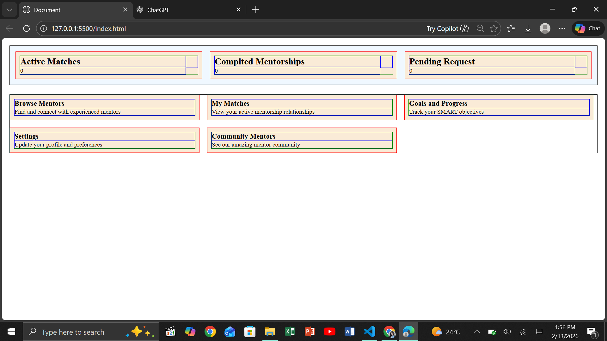

# 📌 Mentorship Dashboard UI

## 📖 Project Overview

This is a fully responsive **Mentorship Dashboard** built using **HTML** and **CSS** as part of my frontend development learning journey. It provides a structured interface where mentorship activities can be monitored, and platform features are easily accessible.

The project focuses on modern UI design principles, well-structured layouts, and maintainable, modular CSS.

---

## 🖼 Screenshot

  
*Dashboard view showing metrics and navigation cards.*

---

## 🎯 Learning Goals

The main objectives of this project were to:

- Build clean and organized UI layouts  
- Write scalable and maintainable CSS  
- Understand component-based design  
- Develop reusable layout systems  
- Apply modern frontend development best practices  

---

## ✨ Features Implemented

- Card-based layout for dashboard metrics  
- Navigation cards for mentorship sections  
- Reusable Flexbox container system  
- Utility-based border styling  
- Modular CSS structure for easier maintenance  
- Semantic and accessible HTML  

---

## 🛠 Technologies Used

- HTML5  
- CSS3  
- Flexbox  
- BEM (Block Element Modifier) Naming Methodology  

---

## 📂 Project Structure

Mentorship-Dashboard
│
├── index.html
└── docs
└── Screenshot.png

---

## 🎨 Design Focus

Special attention was given to:

- Card-based layout for dashboard elements  
- Consistent spacing and typography  
- Clean, readable UI structure  
- Reusable styling approach  
- Proper alignment using Flexbox  

---

## 📚 Key Learning Outcomes

Through this project, I learned how to:

- Apply BEM naming conventions for better CSS organization  
- Create reusable UI components  
- Structure layouts effectively using Flexbox  
- Write clean and maintainable CSS  
- Understand professional UI layout standards  

---

## 🚀 Future Goals

Planned enhancements include:

- Adding JavaScript interactivity  
- Improving responsiveness across devices  
- Integrating backend functionality  
- Displaying dynamic dashboard data  
- Enhancing user experience with animations  

---

## 👩‍💻 Author

This project is part of my ongoing frontend development journey. I am continuously refining my **UI design** and **web development skills** to create clean, user-friendly interfaces.
